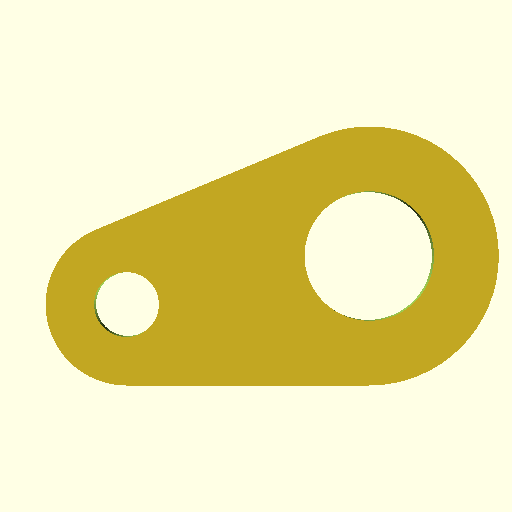

# STL Stretch

This script lets you modify stl files by scaling them, including by scaling just
a section along an axis.

Requirements:

* Python 2.7+ including Python 3.x
* Nose in order to run the tests

## How does it work?

For example, let's say you have this file, but want it to be wider:

You coud scale it by a fixed amount through the whole way, but that will make
the circles out of round, which you might need for screws or something else:

To use this script, you need to find (or guess and iterate) on the coordinates
the bound where you want to modify, for example to stretch between X=9 and X=15,
the script divides it into 3 segments:

The no-op change would be `python stl.py --stretch "X 9 15 0" -o new.stl
old.stl`.  Note the `0`.  If you want to expand this region by 7.5 units
(typically mm by convention) then change the `0` to `7.5`.

The resulting file is one without gaps, those are just for illustration.
